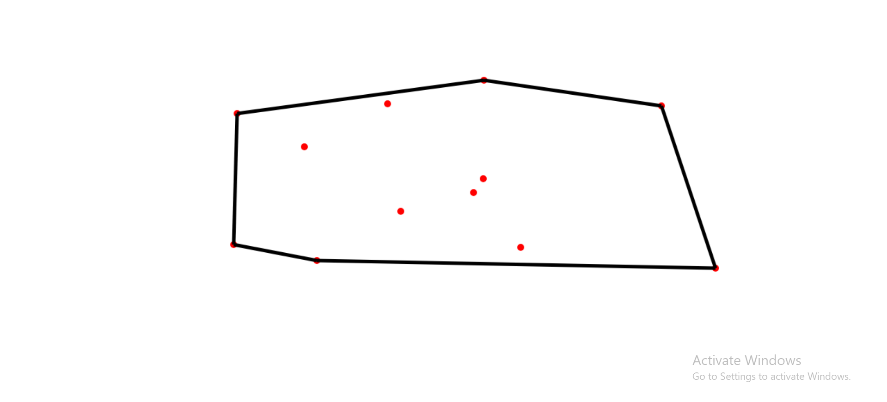

# Convex Hull Visualizer

A simple interactive web application to visualize the Convex Hull algorithm using JavaScript and HTML5 Canvas. This application implements the Graham Scan algorithm for finding the convex hull.

## Demo

The convex hull of a set of points is the smallest convex polygon that encloses all the points. Think of it as stretching a rubber band around the points - the shape it forms is the convex hull.

## How to Use

1. Open `index.html` in a web browser
2. Click anywhere on the canvas to add points
3. Press the `Enter` key to toggle the display of the convex hull
4. Add more points to see how the convex hull changes dynamically

- Vector mathematics and drawing utilities from custom built [Library.js module](https://github.com/UmarAdam9/JavaScript-2D-game-dev-Library)

